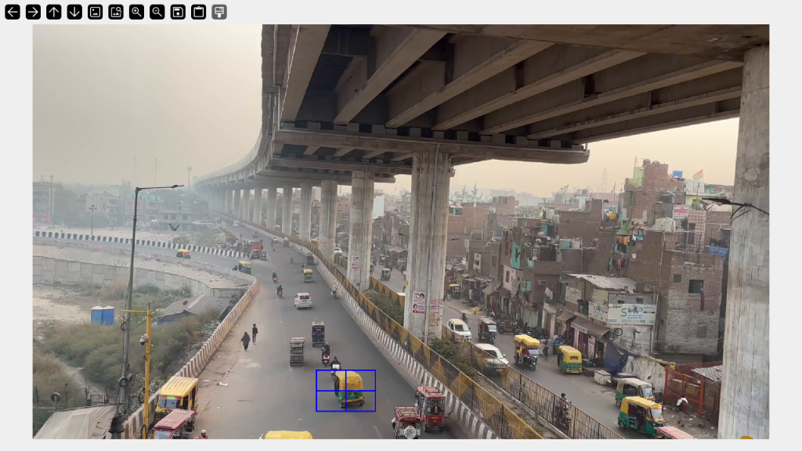
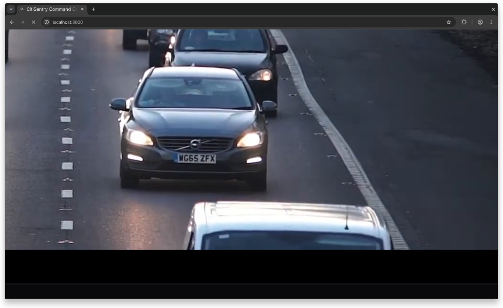

<div align="center">
  
  
  <br/>

  # 🛡️ CitiSentry
  ### Tactical Multi-Camera ANPR Trajectory Engine & Command Center
  
  **SIH Problem Statement ID:** `SIH26127` &nbsp;&nbsp;|&nbsp;&nbsp; **Nodal Org:** `Bharat Electronics Limited (BEL)`

  
  
  
  
  
</div>

---

## 📖 Overview

**CitiSentry** is a state-of-the-art tactical surveillance and computer vision intelligence system. It is engineered to maintain unbroken, cross-camera chain-of-custody tracking of target vehicles across sprawling, city-scale CCTV grids. 

Even when license plates are obscured, occluded, or completely missing, CitiSentry locks onto a vehicle's physical identity using deep visual embeddings, tracks movement through severe occlusions, mathematically verifies trajectory feasibility via road kinematics, and renders active pursuit vectors on a defense-grade Command Console.

<div align="center">
  
</div>

---

## ⚡ Core Capabilities

| Feature | Description | Technology Backbone |
| :--- | :--- | :--- |
| **Deep Visual Re-ID** | Identifies vehicles across completely blind camera gaps by extracting omni-scale L2-normalized feature embeddings resistant to scale and viewpoint variance. | `OSNet x1.0 (VeRi-776)` |
| **Robust Occlusion Tracking** | Maintains target lock through heavy traffic, buses, and extreme camera tilt via Center-Weighted scoring and two-stage association. | `YOLO11x` + `ByteTrack` |
| **Scale-Constrained Physics Engine** | Prevents impossible Re-ID hijacks by measuring bounding box pixel density. Cleanly triggers Camera Handoffs on Edge or Depth Exits. | `Python cv2` |
| **Spatiotemporal Anomaly Engine** | Triggers instant `SPOOF_ALERT` if a vehicle travels between camera nodes at physically impossible velocities (e.g., > 250 km/h). | `Go (Haversine Distance)` |
| **Tactical GIS Dashboard** | Real-time C2 (Command & Control) interface. Operators draw interactive ROIs directly onto live MJPEG feeds to lock onto suspects. | `Next.js 14` + `Leaflet` |

---

## 🏗️ System Architecture

The software is heavily decoupled into three distinct, highly concurrent microservices:

1. **Python Edge Vision Node (`Port 5000`)**
   - **Detector:** Ultralytics YOLO11x (Extra-Large model with SPPF and C3k2 blocks).
   - **Tracker:** ByteTrack with center-weighted occlusion fallback.
   - **Re-ID Engine:** OSNet x1.0 (Auto-downloads pre-trained weights for Omni-Scale Re-ID).
   - **ANPR Engine:** EasyOCR with $2\times$ bicubic upscaling and negative-lookahead regex filtering.

2. **Go Core Event Broker (`Port 8080`)**
   - High-concurrency event ingestion with `sync.RWMutex` state locks.
   - Automatic Camera Handoff orchestration over Spatial JSON graph configurations.
   - Live Gorilla WebSocket (`ws://`) hub pushing sub-10ms telemetry updates to the tactical frontend.

3. **Next.js Tactical Command Console (`Port 3000`)**
   - Dark-mode tactical HUD (`#0a0e17`) styled with TailwindCSS.
   - Interactive HTML5 Canvas syncing fractional bounding box coordinates over RTSP/MJPEG feeds.
   - Zustand global state store managing `TRK-XXXX` persistent profiles.

---

## 💻 System Prerequisites

| Component | Minimum Version | Recommended Version | Verification Command |
| :--- | :--- | :--- | :--- |
| **Python** | 3.10+ | 3.11 or 3.12 | `python --version` |
| **Node.js** | 18.0+ | 20.0+ LTS | `node --version` |
| **Go** | 1.22+ | 1.22+ | `go version` |

---

## 🚀 Windows Installation & Setup (Official Guide)

We have hardened the Windows installation process to guarantee full PyTorch CUDA compatibility and flawless execution.

### 1. Clone the Repository
Open Command Prompt (`cmd.exe`) or PowerShell:
```powershell
git clone https://github.com/SohanNaik1/CitiSentry.git
cd CitiSentry
```

### 2. Install Web Dashboard Dependencies
```powershell
cd web
npm install --legacy-peer-deps
cd ..
```

### 3. Create & Activate Python Virtual Environment
```powershell
# Create the virtual environment
python -m venv .venv
```
**To activate in Command Prompt (`cmd.exe`):**
```cmd
.venv\Scripts\activate
```
**To activate in PowerShell:**
> **Note:** PowerShell often blocks scripts by default. You MUST bypass the execution policy to activate the environment.
```powershell
Set-ExecutionPolicy -Scope Process -ExecutionPolicy Bypass
.\.venv\Scripts\Activate.ps1
```

### 4. Install Core Python Dependencies
With your `.venv` activated (you should see `(.venv)` in your terminal prompt):

**Option A: NVIDIA GPU Acceleration (Highly Recommended for RTX 3050 / 4090)**
```powershell
python -m pip install --upgrade pip
pip install -r services\edge-vision\requirements.txt --extra-index-url https://download.pytorch.org/whl/cu121
```
**Option B: CPU Only**
```powershell
python -m pip install --upgrade pip
pip install -r services\edge-vision\requirements.txt
```
> **Note:** Our requirements automatically install pre-compiled `lapx` binary wheels on Windows. You **do not** need Microsoft Visual C++ Build Tools. OSNet weights are automatically downloaded on first boot.

---

## ⚡ Running the Platform

### On Windows
Simply execute our self-cleaning launcher script from the root directory:
```cmd
start.bat
```
`start.bat` will automatically clear ghost processes on ports 3000/5000/8080, bind the Go broker, boot the CV pipeline, and launch the web dashboard simultaneously.

### On Linux (Ubuntu / Arch)
```bash
# Ensure ffmpeg and libgl are installed first
sudo apt update && sudo apt install -y ffmpeg libgl1-mesa-glx
./start.sh
```

---

## 🎯 Tactical Console Guide

Navigate to **`http://localhost:3000`** after booting.

- **Locking a Target:** Click and drag a tactical bounding box directly over any vehicle in the live video viewport. CitiSentry will extract the OSNet embedding, lock the frame, and track it with depth and edge-exit awareness.
- **Cross-Camera Re-ID & Handoffs:** When a vehicle drives off the edge of the screen or disappears into the horizon (Depth Exit), the Go Broker will seamlessly handoff to the next configured camera node, updating your UI and drawing a tactical trace line on the map.
- **Spoof Detection:** If the vehicle triggers an impossible temporal transition (e.g., crossing 3 kilometers in 10 seconds), the C2 console will instantly flash a `CRITICAL: CLONED_PLATE_SPOOF` alert banner.

---

## 📂 Architecture Layout

```text
CitiSentry/
├── requirements.txt                    # Centralized python dependencies
├── start.bat / start.sh                # Multi-service bootstrap scripts
├── assets/                             # Architecture & UI screenshots
├── contracts/                          # Canonical JSON schemas & topologies
│   ├── schemas/                        # Telemetry and Alert schemas
│   └── topology/                       # Spatial graphs (spatial_graph.json)
├── services/
│   ├── core-broker/                    # Go 1.22 REST & WebSocket Hub
│   ├── edge-simulator/                 # Python script to replay tracking scenarios
│   └── edge-vision/                    # Python CV pipeline (YOLO11x, OSNet x1.0)
└── web/                                # Next.js 14 Tactical Frontend
    ├── src/components/                 # Map, UI overlays, and Video Viewports
    └── src/stores/                     # Zustand central state management
```